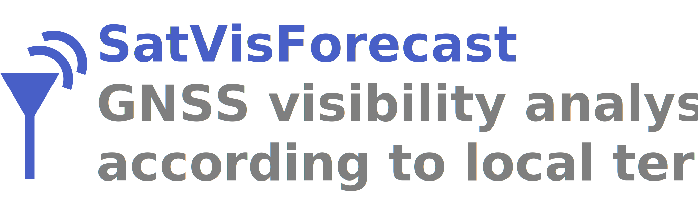
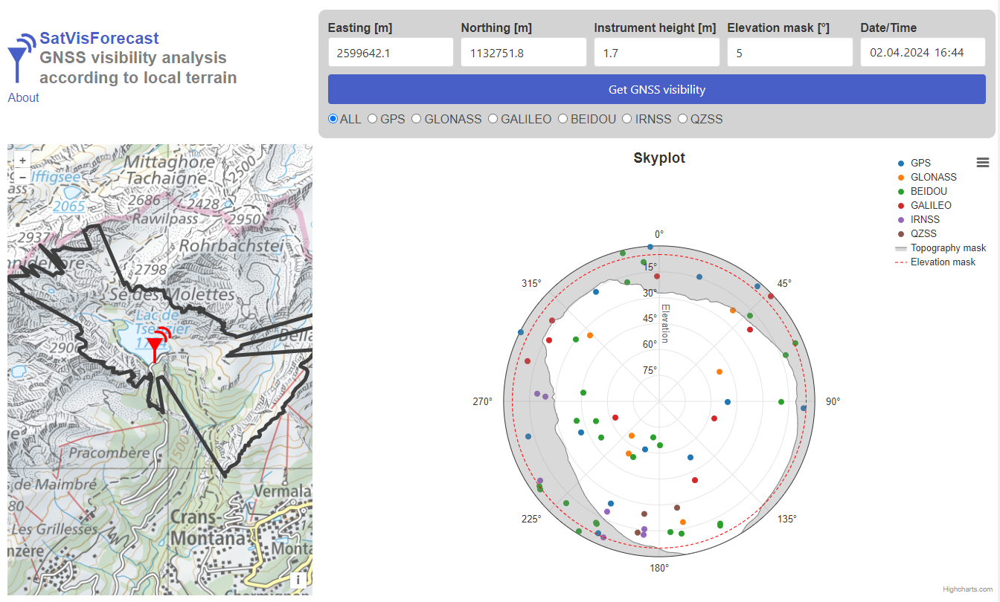

This application prototype was created as part of the "MDT - GIO 2024" course. 
The aim of the web-app is to ge the potential GNSS visibility according to local terrain.

SatVisForecast was developped by a team of 3 people:
- [Matteo Casto](https://github.com/MatteoCasto)
- [Maxime Fourquaux](https://github.com/Maxouch742)
- [Franck Schmidt](https://github.com/franckvs)

The rest of the report is written in French for ease of use.

**Table of contents:**
- [SatVisForecast](#satvisforecast)
  - [Description](#description)
  - [Détails techniques](#détails-techniques)
    - [Workframe (fontend)](#workframe-fontend)
    - [API utilisées](#api-utilisées)
      - [1. Celestrak](#1-celestrak)
      - [2. api3.geo.admin](#2-api3geoadmin)
      - [3. reframe](#3-reframe)
  - [Installation du projet (mode: développeur)](#installation-du-projet-mode-développeur)
  - [Licence (EN)](#licence-en)

## Description 
L'outil **SatVisForecast** permet de fournir une analyse des satellites visibles depuis un point donné en Suisse. Le masque du relief local est généré automatiquement à partir du modèle 3D altimétrique de swisstopo (MNT25) grâce à une API. Cela permet de tenir compte de la topographie locale de chaque lieu pour une analyse pertinente du potentiel GNSS à un temps donné. L'exemple le plus courant se retrouve dans les régions à fort masques topographiques (vallées étroites, etc.).

 **Les paramètres de calcul sont les suivants :**
- Position : Est, Nord (MN95) -> à cliquer sur la carte
- Hauteur de l'instrument
- Angle d'élévation minimum
- Date et heure pour l'analyse (passé, présent et futur)

**Les résultats de l'analyse sont :**
- Plot du ciel (*skyplot*) avec les satellites (au temps demandé avec la trace des satellites de 6h dans le futur), le masque du terrain local et le masque d'élévation général,
- Carte 2D avec emprise du masque du terrain lcoal (ex: crêtes de montagnes)
- Sélection de constellations GNSS spécifiques (ou toutes)



## Détails techniques
### Workframe (frontend)
VueJS

### API utilisées

#### 1. Celestrak

[Celestrak](https://celestrak.org) est un site internet et une API réputées, utilisé dans de nombreux domaines open-source permettant d'assurer un suivi des objets spatiaux en orbite autour de la Terre (Station Spatiale Internationale, satellites GNSS et autres, ...).

La requête est effectuée : [https://celestrak.org/NORAD/elements/gp.php?GROUP=GNSS&FORMAT=JSON](https://celestrak.org/NORAD/elements/gp.php?GROUP=GNSS&FORMAT=JSON) pour obtenir la définition des orbites des satellites, appelés aussi `TLe` pour *Two Line element*. La définition d'orbite que l'on reçoit pour un satellite est la suivante (ex: `NAVSTAR 43 (USA 132)`) :
```  
1 24876U 97035A   24094.49153709  .00000063  00000+0  00000+0 0  9995
2 24876  55.6452 130.0512 0076929  52.0260 308.7395  2.00565460195813
```

Ensuite, grâce à la librairie [satellite-js](https://github.com/shashwatak/satellite-js/tree/release), il est ainsi possible d'obtenir les coordonnées du satellite à l'heure souhaitée par l'utilisateur (ainsi que 6h après cette dernière).


#### 2. api3.geo.admin 
Lien : https://api3.geo.admin.ch/services/sdiservices.html 

 ***Profile***

Utilisation de la partie génération automatique de profil. Permet de générer des profils altimétrique à partir d'une liste de segment, défini par rayonnement tous les degrés. 
Les profils sont générés sur 8km avec 1'000 points soit un point tous les 8m.

#### 3. reframe
[satellite-js](https://github.com/shashwatak/satellite-js/tree/release) a besoin de la position WGS84 du récepteur où l'utilisateur veut travailer.

Les données de bases sont la position `(Est, Nord)` dans le système global suisse `MN95`. 
Par conséquent, nous utilisons l'api de swisstopo [reframe](https://www.swisstopo.admin.ch/fr/rest-api-geodesique-reframe-web) pour passer du système global `MN95`au système global internationale `WGS84`.

Les transformations de coordonnées sont, dans l'ordre :
1. *LN02 to Bessel (ellipsoidal)* : `http://geodesy.geo.admin.ch/reframe/lhn95tobessel`
2. *LV95 to WGS84* : `http://geodesy.geo.admin.ch/reframe/lv95towgs84`

## Installation du projet (mode: développeur)
1. Clone/fork le projet sur votre laptop:
```
git clone https://github.com/Maxouch742/SatVisForecast.git
```
2. Installation des dépendances (si vous n'avez pas NodeJS, il faut préalablement l'installer) :
```
cd frontend
npm install
```
3. Démarage du site internet en local, lancer la commande :
```
npm run serve
```

4. Lancement d'une page web à l'adresse du localhost, par exemple
 ```
App running at:
- Local:   http://localhost:xxxx/ 
- Network: http://192.168.10.153:xxxx/
``` 


## Licence (EN)
Copyright (c) 2024 HES-SO, MSc in geomatics engineering

Permission is hereby granted, free of charge, to any person obtaining a copy of this software and associated documentation files (the "Software"), to deal in the Software without restriction, including without limitation the rights to use, copy, modify, merge, publish, distribute, sublicense, and/or sell copies of the Software, and to permit persons to whom the Software is furnished to do so, subject to the following conditions:

The above copyright notice and this permission notice shall be included in all copies or substantial portions of the Software.

THE SOFTWARE IS PROVIDED "AS IS", WITHOUT WARRANTY OF ANY KIND, EXPRESS OR IMPLIED, INCLUDING BUT NOT LIMITED TO THE WARRANTIES OF MERCHANTABILITY, FITNESS FOR A PARTICULAR PURPOSE AND NONINFRINGEMENT. IN NO EVENT SHALL THE AUTHORS OR COPYRIGHT HOLDERS BE LIABLE FOR ANY CLAIM, DAMAGES OR OTHER LIABILITY, WHETHER IN AN ACTION OF CONTRACT, TORT OR OTHERWISE, ARISING FROM, OUT OF OR IN CONNECTION WITH THE SOFTWARE OR THE USE OR OTHER DEALINGS IN THE SOFTWARE.
